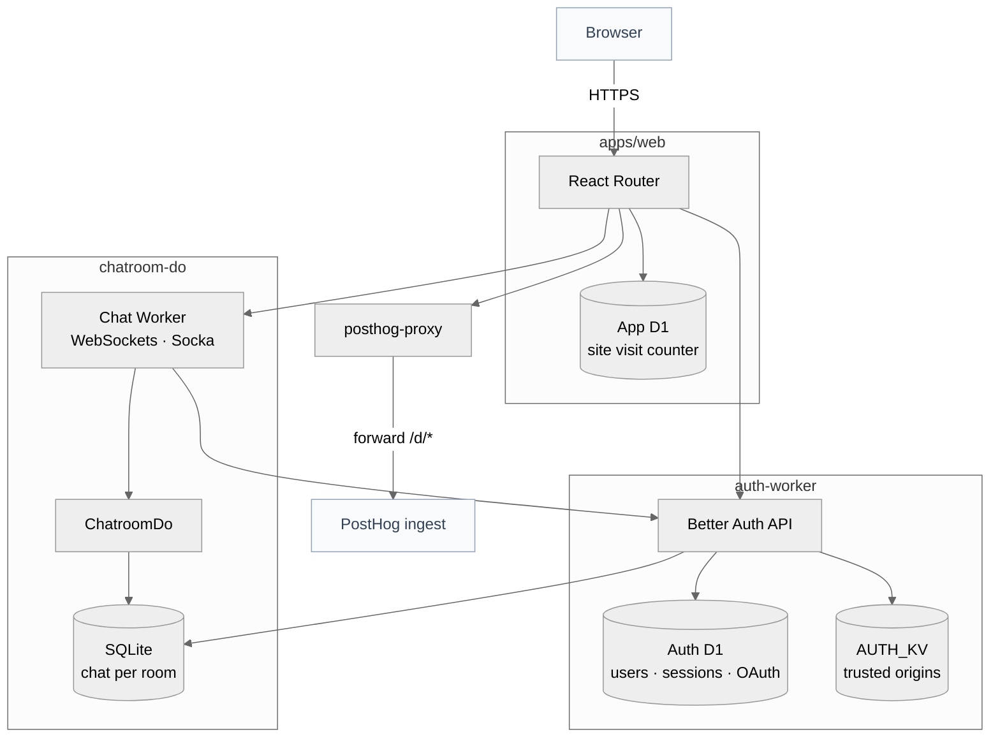

# Cloudflare Multi-Worker Starter Kit

[](https://github.com/your-org/cloudflare-multiworker-template/generate)
[](https://github.com/your-org/cloudflare-multiworker-template/blob/main/README.md#license)

[](https://www.typescriptlang.org/)
[](https://developers.cloudflare.com/workers/)
[](https://developers.cloudflare.com/durable-objects/)
[](https://turbo.build/)
[](https://reactrouter.com/)
[](https://bun.sh/)
[](https://hono.dev/)
[](https://alchemy.run/)


A production-minded starter for full-stack Cloudflare apps: React Router on Workers, Durable Objects, D1, Drizzle, Hono, typed bindings, Turborepo, and Alchemy deploys. Copy it, rename it, ship it. The demo covers SSR, D1, service bindings, Durable Objects, and WebSockets.
## What you get

- **React Router 7 on Workers** — streaming SSR, Tailwind, typed loaders/actions, form actions.
- **Durable Object example** — Socka WebSockets + DO SQLite on `/chat` (`chatroom-do`), with auth session gating via service bindings.
- **Better Auth (`auth-worker`)** — email/password + optional Google/GitHub, admin UI (`/admin`), account display names; anonymous guests on `/chat` (7-day sliding session, random names like `Coastal-Falcon`).
- **D1 + Drizzle** — root app DB (`/visitors`) plus separate auth D1 (`@internal/auth-db`).
- **Typed bindings** — package-local `alchemy.run.ts` → Worker `env` types.
- **Deploy story** — Turbo + Alchemy, staging/production, PR previews (details below only when you need them).

## When you need more

| Goal | Where |
|------|--------|
| Web routes, SSR, bindings, forms | [`apps/web/README.md`](apps/web/README.md) |
| Auth, OAuth, admin, anonymous chat guests | [`docs/oauth-setup.md`](docs/oauth-setup.md) (Google/GitHub) · [`.agents/skills/cf-auth-setup/SKILL.md`](.agents/skills/cf-auth-setup/SKILL.md) · [`.env.example`](.env.example) |
| GitHub Environments, rulesets, what runs in CI, custom domains | [`docs/github-admin.md`](docs/github-admin.md) |
| `.env.local` / staging / prod secrets | [`.env.example`](.env.example) · [`.agents/skills/cf-workers-env-local/SKILL.md`](.agents/skills/cf-workers-env-local/SKILL.md) |
| Full rebrand (package names, UI copy) | [`.agents/skills/project-init/SKILL.md`](.agents/skills/project-init/SKILL.md) |
| Typegen cadence, Turbo deploy order, generated artifacts | [`.agents/skills/multiworker-workflow/SKILL.md`](.agents/skills/multiworker-workflow/SKILL.md) |
| Cursor / IDE rules look wrong after clone | `bun run agents:link` · [`.agents/README.md`](.agents/README.md) |

**Bun:** use the version in root [`package.json`](package.json) → `packageManager` (CI matches it).

## Quick start

**Prerequisites:** [Bun](https://bun.sh/) (see `packageManager` above), git, a [Cloudflare](https://dash.cloudflare.com/) account for local Alchemy resources, and **[Portless](https://portless.sh/)** for the default local HTTPS dev URL (`https://<PRODUCT_PREFIX>-web.localhost`, e.g. **`starter-web.localhost`** with stock **`PRODUCT_PREFIX`**) — install / service / trust in **[CONTRIBUTING.md — Local HTTPS dev](CONTRIBUTING.md#local-https-dev-portless)**. For plain **`http://localhost`** only, set **`LOCAL_PORTLESS=off`** in **`.env.local`** (or use **`bun run setup:local`** → category **Local dev HTTPS (Portless)**).

Create a repo from the template:

```bash
gh repo create my-project --template your-org/cloudflare-multiworker-template --public
cd my-project
```

Or **Use this template** on the [GitHub repository](https://github.com/your-org/cloudflare-multiworker-template) (replace `your-org` with the template owner).

### Run locally

```bash
bun run quickstart
```

That installs dependencies if `node_modules` is missing, fills **missing** regeneratable keys in `.env.local`, runs a dev preflight, then starts the dev stack. It does **not** rotate existing secrets.

On a new machine you may need Alchemy linked to Cloudflare **once**:

```bash
bun alchemy configure
bun alchemy login
```

Then rerun **`bun run quickstart`** (or **`bun run dev`** if `.env.local` is already set).

Open the URL Vite prints — with Portless (default), **`Local:`** is **`https://<PRODUCT_PREFIX>-web.localhost/`** (see [CONTRIBUTING — Portless](CONTRIBUTING.md#local-https-dev-portless)); otherwise often **`http://localhost:5173`**. Try **`/`**, **`/visitors`**, **`/chat`** (anonymous guest sign-in), **`/login`**, **`/account`**. Set **`AUTH_BOOTSTRAP_ADMIN_EMAILS`** in **`.env.local`** to access **`/admin`** after signing in with that email.

### Deploy with GitHub Actions (optional)

Before meaningful deploys, [name your product](#name-your-product) so Cloudflare/Alchemy names match your app.

You need a Cloudflare **API token** and **Account ID** from the dashboard (this template does not create tokens — [step-by-step](docs/github-admin.md#cloudflare-credentials-manual)). Put them in **`.env.staging`** / **`.env.production`**, **or** once in the machine-wide **account** file (**`bun run setup:account`**, paths in [`.env.example`](.env.example)) so you do not duplicate **`CLOUDFLARE_*`** / **`ALCHEMY_STATE_TOKEN`** in every repo. Token and account must be the **same** Cloudflare account.

**Suggested order for staging + prod:**

1. **`bun run setup:account`** (optional) — shared **`CLOUDFLARE_ACCOUNT_ID`**, **`CLOUDFLARE_API_TOKEN`**, **`ALCHEMY_STATE_TOKEN`** on this machine.
2. **`bun run setup:staging`** then **`bun run github:sync:staging`** (or **`bun run onboard:staging`**).
3. **`bun run setup:prod`** then **`bun run github:sync:prod`** (or **`bun run onboard:prod`**).

Per-environment secrets (**`ALCHEMY_PASSWORD`**, **`CHATROOM_INTERNAL_SECRET`**, **`BETTER_AUTH_SECRET`**, **`AUTH_ADMIN_SECRET`**, optional **`AUTH_BOOTSTRAP_ADMIN_EMAILS`**, optional **`WEB_*`**) stay in each stage dotfile (or GitHub Environments after sync). **No auth URL env var** — Alchemy derives the public auth URL from the local web origin, **`WEB_DOMAINS`**, or web **workers.dev** (see [cf-auth-setup](.agents/skills/cf-auth-setup/SKILL.md)).

With [`gh`](https://cli.github.com/) authenticated and repo admin rights, from a trusted machine:

```bash
bun run onboard:staging   # sync staging → push/merge to `main` deploys staging after CI
bun run onboard:prod      # sync production → deploys from `production` branch (see docs)
```

**`bun run github:setup`** prints a fuller Actions checklist. Workflow behavior, **`DEPLOY_ENABLED`**, fork vs same-repo PR previews, rulesets, and **`AUTO_PRODUCTION_PR`**: [`docs/github-admin.md`](docs/github-admin.md).

### If setup fails

- **Local:** Alchemy auth — `bun alchemy configure`, `bun alchemy login`; optional **`CLOUDFLARE_*`** in **`.env.local`** or **`setup:account`** (machine-wide file). Missing generated secrets — **`bun run setup:local`** or rerun **`quickstart`**.
- **`onboard:staging`:** Cloudflare credentials in **`.env.staging`**, **`setup:staging`**, or the machine **account** file; **`gh auth login`**.
- **`onboard:prod`:** same for `.env.production`, or **`ONBOARD_PROD_COPY_CF=1`** to copy token/account from `.env.staging` (non-interactive).
- **Wrong account:** token and Account ID must match the same Cloudflare account.

## Name your product

### Code-first infra names

**Alchemy app ids** (e.g. `skybook-frontend`, `skybook-database`) come from one place:

1. Set **`PRODUCT_PREFIX`** in [`packages/alchemy-utils/src/worker-peer-scripts.ts`](packages/alchemy-utils/src/worker-peer-scripts.ts) (default `starter` → your slug).
2. Run **`bun run typegen`**.
3. Adjust visible product copy when you want.

**Workspace package names** and Turbo **`--filter`** values (e.g. `@internal/web`) are separate from those ids. Full checklist: [`.agents/skills/project-init/SKILL.md`](.agents/skills/project-init/SKILL.md).

## Deploy

Use gitignored stage files from the repo root:

```bash
bun run setup:staging
bun run deploy:staging

bun run setup:prod
bun run deploy:prod
```

Each command runs the **full** Turbo graph (shared Alchemy state, D1 + migrations, workers/DOs, then the web app with bindings). Required keys: [`.env.example`](.env.example). Keep **`ALCHEMY_PASSWORD`** the same everywhere that stage deploys (local, CI, teammates).

**Custom domains** (`WEB_*` env vars): [`docs/github-admin.md`](docs/github-admin.md#custom-domains-web-worker).

**Optional PostHog:** leave keys empty to stay dark; wiring/removal notes: [`apps/web/README.md`](apps/web/README.md#optional-posthog).

## Architecture

Only **`apps/web`** faces the internet. Every other worker is a **service binding** ([`apps/web/alchemy.run.ts`](apps/web/alchemy.run.ts)). The web worker gates chat sessions with **`auth-worker`**, then forwards WebSocket upgrades to **`chatroom-do`** with attested headers.



**Common request paths** (detail in [`apps/web/README.md`](apps/web/README.md)):

| Flow | Path |
|------|------|
| **Auth / sessions** | Browser → web `/api/auth/*` → `AUTH.fetch` → auth-worker (Better Auth + auth D1). Loaders use `env.AUTH` via `@internal/auth-client`. |
| **Chat WebSocket** | Browser → web `/api/ws/*` → session or attest token check in web → `CHATROOM.fetch` with attestation headers → chatroom-do verifies the worker-to-worker request. |

Bindings and route wiring: [`apps/web/alchemy.run.ts`](apps/web/alchemy.run.ts), [`apps/web/workers/hono-app.ts`](apps/web/workers/hono-app.ts). Adding a worker: [Adding workers](#adding-workers) below.

## Project layout

```text
├── apps/
│   └── web/                    # React Router app + Worker entry
├── workers/
│   ├── auth-worker/            # Better Auth API, admin routes, trusted origins KV
│   └── posthog-proxy/          # Optional PostHog reverse proxy
├── durable-objects/
│   └── chatroom-do/
├── packages/
│   ├── alchemy-utils/          # PRODUCT_PREFIX, app ids, alchemy-cli
│   ├── auth-client/            # getSession, ensureChatSession, binding headers for AUTH.fetch
│   ├── auth-db/                # Better Auth D1 schema + migrations
│   ├── chat-contract/
│   ├── db/                     # App D1 schema + Drizzle migrations (/visitors)
│   ├── scripts/                # quickstart, setup, onboard, GitHub sync helpers
│   └── state-hub/              # shared remote Alchemy state (non-local STAGE)
├── stacks/                     # admin / GitHub sync (Alchemy)
├── .agents/                     # AI rules + skills (human playbooks too)
├── .cursor/                    # Cursor env + symlinks to .agents/
└── .claude/                    # optional Claude Code symlinks
```

**Entry points:** `apps/web/alchemy.run.ts`, `apps/web/workers/app.ts`, `packages/db/src/schema.ts`, `packages/alchemy-utils/src/worker-peer-scripts.ts`.

## Working in the repo

From the repo root:

```bash
bun run typegen
bun run typecheck
bun run lint
bun run build
```

Run **`typegen`** after routes, `alchemy.run.ts`, or binding/env changes. Run **`bun run db:generate`** after editing `packages/db/src/schema.ts`; run **`bun run db:generate:auth`** after editing `packages/auth-db/src/schema.ts`. Do not hand-edit Drizzle SQL/snapshots, React Router `+types`, or `.alchemy/`.

Bindings in app code:

```typescript
import { env } from "cloudflare:workers";
```

Do not read Worker bindings from React Router loader/action `context` in this repo.

## Adding workers

```bash
bunx turbo gen durable-object
```

Then: add the package to root **`dev`** filters if it should run locally; fix **`turbo.json`** deploy/destroy order as needed; add a workspace dep from **`apps/web`** if the web app uses it; import its **`./alchemy`** from **`apps/web/alchemy.run.ts`**; run **`bun run typegen`** and **`bun run typecheck`**.

Details: [`.agents/skills/cf-durable-object-package/SKILL.md`](.agents/skills/cf-durable-object-package/SKILL.md), [`.agents/skills/cf-web-alchemy-bindings/SKILL.md`](.agents/skills/cf-web-alchemy-bindings/SKILL.md), [`.agents/skills/cf-worker-rpc-turbo/SKILL.md`](.agents/skills/cf-worker-rpc-turbo/SKILL.md).

## Common scripts

| Area | Commands |
|------|----------|
| Dev | `dev`, `quickstart`, `build`, `typegen`, `typecheck`, `lint`, `clean` — **`dev`** uses **[Portless](https://portless.sh/)** HTTPS by default ([CONTRIBUTING](CONTRIBUTING.md#local-https-dev-portless); opt out with **`LOCAL_PORTLESS=off`**) |
| Deploy | `deploy:staging`, `deploy:prod`, `deploy:preview`, `destroy:*`, `deploy:preflight:*` |
| GitHub Environments | `github:setup`, `github:sync:staging`, `github:sync:prod`, `github:sync`, `github:env:*`, `github:sync:config` |
| DB | `db:generate`, `check:drizzle-generated` |

More context: [`.agents/skills/multiworker-workflow/SKILL.md`](.agents/skills/multiworker-workflow/SKILL.md), [`docs/github-admin.md`](docs/github-admin.md).

## Deeper docs

- [`CONTRIBUTING.md`](CONTRIBUTING.md) — PRs and checks.
- [`AGENTS.md`](AGENTS.md) — index for AI assistants; **`.agents/skills/`** are deep playbooks (optional for humans).

## Stack

[Cloudflare Workers](https://workers.cloudflare.com/) + [Durable Objects](https://developers.cloudflare.com/durable-objects/) + [React Router 7](https://reactrouter.com/) + [Hono](https://hono.dev/) + [D1](https://developers.cloudflare.com/d1/) + [Drizzle](https://orm.drizzle.team/) + [Turborepo](https://turbo.build/repo) + [Alchemy](https://alchemy.run/) + [Biome](https://biomejs.dev/) + [Bun](https://bun.sh/) + [Zod](https://zod.dev/).

## Security posture

Real infra + demo routes: treat as a starting point. **This** repository’s stock workflows use GitHub Environments for **same-repo** PR previews (**`staging`**), production deploys from **`production`**, and guardrails so **fork** PRs never receive preview deploy secrets. Auth is included for demonstration (Better Auth + admin UI + anonymous chat guests)—harden for production (CSP, rate limits, OAuth review, least-privilege tokens). See [`.agents/skills/cf-auth-setup/SKILL.md`](.agents/skills/cf-auth-setup/SKILL.md), [`docs/github-admin.md`](docs/github-admin.md), and [`.agents/skills/cf-workers-env-local/SKILL.md`](.agents/skills/cf-workers-env-local/SKILL.md).

## Contributing

See [`CONTRIBUTING.md`](CONTRIBUTING.md).

## License

MIT
